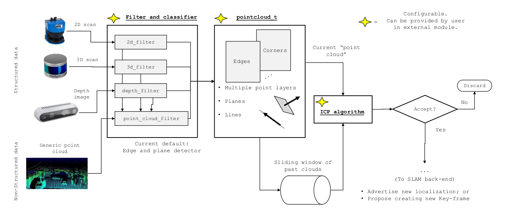

# mola-fe-lidar
MOLA module: Front-end for point-cloud sensors.

Provided MOLA modules:
* `LidarOdometry`: type `FrontEnd`.

## Build and install
Refer to the [root MOLA repository](https://github.com/MOLAorg/mola).

## Docs and examples
See this package page [in the documentation](https://docs.mola-slam.org/latest/modules.html).

## License
This package is released under the GNU GPL v3 license.
